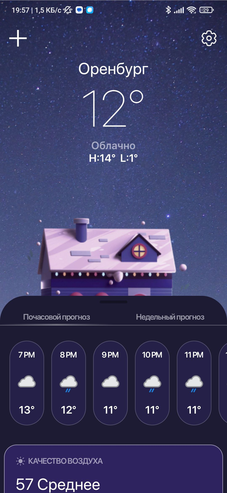
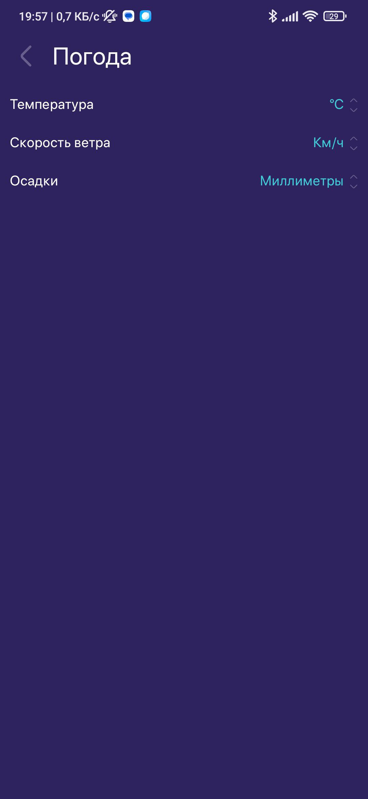
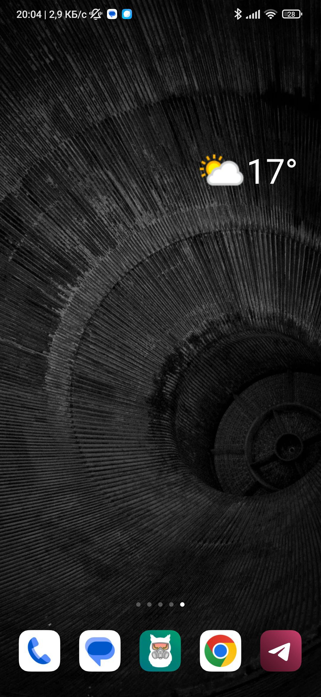

## О приложении  
Приложения для прогноза погоды  
  

   

## Используемые технологии  
<tr><td valign="top" >

- Kotlin  
  

- Jetpack compose  
  

- Navigation compose  
  

- Hilt  
  

- Retrofit  
  

- Motion layout  
  

- Coroutines  
  

- Work manager  
  

- Glance widget  

</td>

   

## Функционал  
<tr><td valign="top" >

- Показ данных о погоде: температура(минимальная, максимальная, по часам, по дням), качество воздуха, индекс УФ-излучения, восход солнца, ветер, осадки, влажность
  

- Выбор единиц измерения 
  

- Определение местоположения
  

- Выбор местоположения
  

- Показ виджета с данными о погоде
  

</td>

 

## Скриншоты  
<tr><td valign="top" >

</td><td valign="top" width="50%">

  
  
  
  

</td></tr></table>

